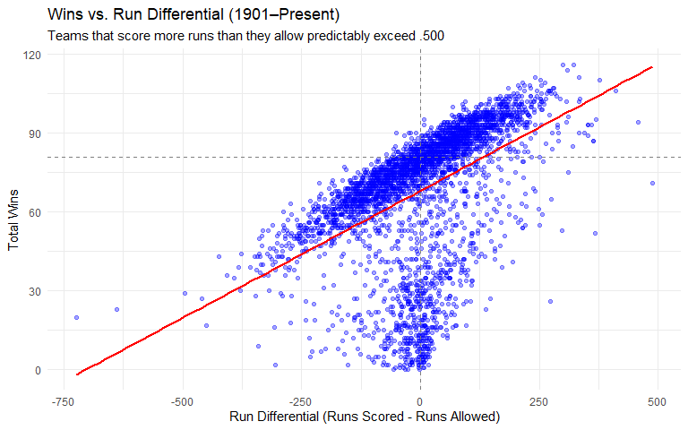
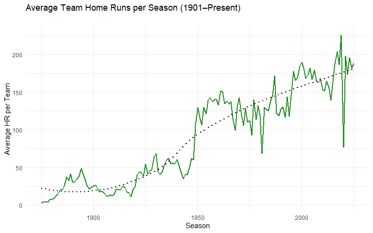

Baseball Analysis
================
Chris Collum

------------------------------------------------------------------------

Install Packages if needed, and Load

``` r
# Install packages if not already present:
# install.packages(c("Lahman", "tidyverse", "scales"))

library(Lahman)
library(tidyverse)
library(scales)

# Load the Teams dataset
data("Teams")

# Convert to tibble for clean console printing
teams <- as_tibble(Teams)
```

Structure of Data

``` r
# Dataset dimensions
dim(teams)
```

    ## [1] 3614   48

``` r
# Glimpse variable types and names
glimpse(teams)
```

    ## Rows: 3,614
    ## Columns: 48
    ## $ yearID         <int> 1871, 1871, 1871, 1871, 1871, 1871, 1871, 1871, 1871, 1…
    ## $ lgID           <fct> NA, NA, NA, NA, NA, NA, NA, NA, NA, NA, NA, NA, NA, NA,…
    ## $ teamID         <fct> BS1, CH1, CL1, FW1, NY2, PH1, RC1, TRO, WS3, BL1, BR1, …
    ## $ franchID       <fct> BNA, CNA, CFC, KEK, NNA, PNA, ROK, TRO, OLY, BLC, ECK, …
    ## $ divID          <chr> NA, NA, NA, NA, NA, NA, NA, NA, NA, NA, NA, NA, NA, NA,…
    ## $ Rank           <int> 3, 2, 8, 7, 5, 1, 9, 6, 4, 2, 9, 6, 1, 7, 8, 3, 4, 5, 1…
    ## $ G              <int> 31, 28, 29, 19, 33, 28, 25, 29, 32, 58, 29, 37, 48, 22,…
    ## $ Ghome          <int> NA, NA, NA, NA, NA, NA, NA, NA, NA, NA, NA, NA, NA, NA,…
    ## $ W              <int> 20, 19, 10, 7, 16, 21, 4, 13, 15, 35, 3, 9, 39, 6, 5, 3…
    ## $ L              <int> 10, 9, 19, 12, 17, 7, 21, 15, 15, 19, 26, 28, 8, 16, 19…
    ## $ DivWin         <chr> NA, NA, NA, NA, NA, NA, NA, NA, NA, NA, NA, NA, NA, NA,…
    ## $ WCWin          <chr> NA, NA, NA, NA, NA, NA, NA, NA, NA, NA, NA, NA, NA, NA,…
    ## $ LgWin          <chr> "N", "N", "N", "N", "N", "Y", "N", "N", "N", "N", "N", …
    ## $ WSWin          <chr> NA, NA, NA, NA, NA, NA, NA, NA, NA, NA, NA, NA, NA, NA,…
    ## $ R              <int> 401, 302, 249, 137, 302, 376, 231, 351, 310, 617, 152, …
    ## $ AB             <int> 1372, 1196, 1186, 746, 1404, 1281, 1036, 1248, 1353, 25…
    ## $ H              <int> 426, 323, 328, 178, 403, 410, 274, 384, 375, 753, 248, …
    ## $ X2B            <int> 70, 52, 35, 19, 43, 66, 44, 51, 54, 106, 29, 35, 107, 2…
    ## $ X3B            <int> 37, 21, 40, 8, 21, 27, 25, 34, 26, 31, 9, 10, 30, 5, 9,…
    ## $ HR             <int> 3, 10, 7, 2, 1, 9, 3, 6, 6, 14, 0, 1, 7, 0, 2, 4, 4, 5,…
    ## $ BB             <int> 60, 60, 26, 33, 33, 46, 38, 49, 48, 29, 18, 19, 29, 17,…
    ## $ SO             <int> 19, 22, 25, 9, 15, 23, 30, 19, 13, 28, 40, 25, 26, 13, …
    ## $ SB             <int> 73, 69, 18, 16, 46, 56, 53, 62, 48, 53, 8, 19, 48, 12, …
    ## $ CS             <int> 16, 21, 8, 4, 15, 12, 10, 24, 13, 18, 13, 16, 14, 3, 7,…
    ## $ HBP            <int> NA, NA, NA, NA, NA, NA, NA, NA, NA, NA, NA, NA, NA, NA,…
    ## $ SF             <int> NA, NA, NA, NA, NA, NA, NA, NA, NA, NA, NA, NA, NA, NA,…
    ## $ RA             <int> 303, 241, 341, 243, 313, 266, 287, 362, 303, 434, 413, …
    ## $ ER             <int> 109, 77, 116, 97, 121, 137, 108, 153, 137, 166, 160, 16…
    ## $ ERA            <dbl> 3.55, 2.76, 4.11, 5.17, 3.72, 4.95, 4.30, 5.51, 4.37, 2…
    ## $ CG             <int> 22, 25, 23, 19, 32, 27, 23, 28, 32, 48, 28, 37, 41, 15,…
    ## $ SHO            <int> 1, 0, 0, 1, 1, 0, 1, 0, 0, 1, 0, 0, 4, 0, 0, 3, 1, 2, 0…
    ## $ SV             <int> 3, 1, 0, 0, 0, 0, 0, 0, 0, 1, 0, 0, 4, 0, 0, 1, 0, 1, 0…
    ## $ IPouts         <int> 828, 753, 762, 507, 879, 747, 678, 750, 846, 1548, 778,…
    ## $ HA             <int> 367, 308, 346, 261, 373, 329, 315, 431, 371, 573, 484, …
    ## $ HRA            <int> 2, 6, 13, 5, 7, 3, 3, 4, 4, 3, 7, 6, 0, 6, 6, 2, 3, 2, …
    ## $ BBA            <int> 42, 28, 53, 21, 42, 53, 34, 75, 45, 63, 36, 21, 27, 24,…
    ## $ SOA            <int> 23, 22, 34, 17, 22, 16, 16, 12, 13, 77, 13, 13, 29, 11,…
    ## $ E              <int> 243, 229, 234, 163, 235, 194, 220, 198, 218, 432, 274, …
    ## $ DP             <int> 24, 16, 15, 8, 14, 13, 14, 22, 20, 22, 9, 15, 44, 17, 1…
    ## $ FP             <dbl> 0.834, 0.829, 0.818, 0.803, 0.840, 0.845, 0.821, 0.845,…
    ## $ name           <chr> "Boston Red Stockings", "Chicago White Stockings", "Cle…
    ## $ park           <chr> "South End Grounds I", "Union Base-Ball Grounds", "Nati…
    ## $ attendance     <int> NA, NA, NA, NA, NA, NA, NA, NA, NA, NA, NA, NA, NA, NA,…
    ## $ BPF            <int> 103, 104, 96, 101, 90, 102, 97, 101, 94, 106, 87, 115, …
    ## $ PPF            <int> 98, 102, 100, 107, 88, 98, 99, 100, 98, 102, 96, 122, 1…
    ## $ teamIDBR       <chr> "BOS", "CHI", "CLE", "KEK", "NYU", "ATH", "ROK", "TRO",…
    ## $ teamIDlahman45 <chr> "BS1", "CH1", "CL1", "FW1", "NY2", "PH1", "RC1", "TRO",…
    ## $ teamIDretro    <chr> "BS1", "CH1", "CL1", "FW1", "NY2", "PH1", "RC1", "TRO",…

``` r
# Range of years covered
range(teams$yearID)
```

    ## [1] 1871 2025

Trim Some Data out

``` r
teams_filter <- teams %>%
  filter(yearID >= 1875) %>%
  mutate(
    WinPct = round(W / G, 3),
    RunDiff = R - RA
  ) %>%
  select(yearID, lgID, teamID, name, G, W, L, R, RA, RunDiff, WinPct, HR, ERA, WSWin)

head(teams_filter)
```

    ## # A tibble: 6 × 14
    ##   yearID lgID  teamID name        G     W     L     R    RA RunDiff WinPct    HR
    ##    <int> <fct> <fct>  <chr>   <int> <int> <int> <int> <int>   <int>  <dbl> <int>
    ## 1   1875 NA    BR2    Brookl…    44     2    42   132   438    -306  0.045     2
    ## 2   1875 NA    BS1    Boston…    82    71     8   831   343     488  0.866    15
    ## 3   1875 NA    CH2    Chicag…    69    30    37   379   416     -37  0.435     0
    ## 4   1875 NA    HR1    Hartfo…    86    54    28   557   343     214  0.628     2
    ## 5   1875 NA    KEO    Keokuk…    13     1    12    45    88     -43  0.077     0
    ## 6   1875 NA    NH1    New Ha…    47     7    40   170   397    -227  0.149     2
    ## # ℹ 2 more variables: ERA <dbl>, WSWin <chr>

## Exploring the Data

Run Differential and Wins

``` r
ggplot(teams_filter, aes(x = RunDiff, y = W)) +
  geom_point(alpha = 0.35, color = "blue") +
  geom_smooth(method = "lm", color = "red", se = FALSE) +
  geom_hline(yintercept = 81, linetype = "dashed", color = "gray50") +
  geom_vline(xintercept = 0, linetype = "dashed", color = "gray50") +
  labs(
    title = "Wins vs. Run Differential (1901–Present)",
    subtitle = "Teams that score more runs than they allow predictably exceed .500",
    x = "Run Differential (Runs Scored - Runs Allowed)",
    y = "Total Wins"
  ) +
  theme_minimal()
```

<!-- -->

Home Runs Over Time

``` r
teams_filter %>%
  group_by(yearID) %>%
  summarize(mean_hr = mean(HR, na.rm = TRUE)) %>%
  ggplot(aes(x = yearID, y = mean_hr)) +
  geom_line(color = "forestgreen", linewidth = 1) +
  geom_smooth(se = FALSE, color = "black", linetype = "dotted") +
  labs(
    title = "Average Team Home Runs per Season (1901–Present)",
    subtitle = "",
    x = "Season",
    y = "Average HR per Team"
  ) +
  theme_minimal()
```

<!-- -->

Best 10 Seasons Ever

``` r
teams_filter %>%
  arrange(desc(W)) %>%
  select(yearID, name, W, L, WinPct, RunDiff, WSWin) %>%
  slice_head(n = 10) %>%
  knitr::kable(
    caption = "Top 10 Modern Single-Season Win Totals",
    col.names = c("Year", "Team", "Wins", "Losses", "Win %", "Run Diff", "Won WS?")
  )
```

| Year | Team                | Wins | Losses | Win % | Run Diff | Won WS? |
|-----:|:--------------------|-----:|-------:|------:|---------:|:--------|
| 1906 | Chicago Cubs        |  116 |     36 | 0.753 |      323 | N       |
| 2001 | Seattle Mariners    |  116 |     46 | 0.716 |      300 | N       |
| 1998 | New York Yankees    |  114 |     48 | 0.704 |      309 | Y       |
| 1954 | Cleveland Indians   |  111 |     43 | 0.712 |      242 | N       |
| 2022 | Los Angeles Dodgers |  111 |     51 | 0.685 |      334 | N       |
| 1909 | Pittsburgh Pirates  |  110 |     42 | 0.714 |      252 | Y       |
| 1927 | New York Yankees    |  110 |     44 | 0.710 |      376 | Y       |
| 1961 | New York Yankees    |  109 |     53 | 0.669 |      215 | Y       |
| 1969 | Baltimore Orioles   |  109 |     53 | 0.673 |      262 | N       |
| 1970 | Baltimore Orioles   |  108 |     54 | 0.667 |      218 | Y       |

Top 10 Modern Single-Season Win Totals
